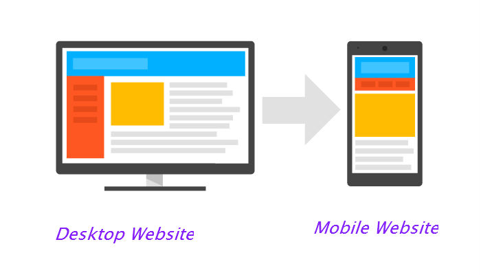
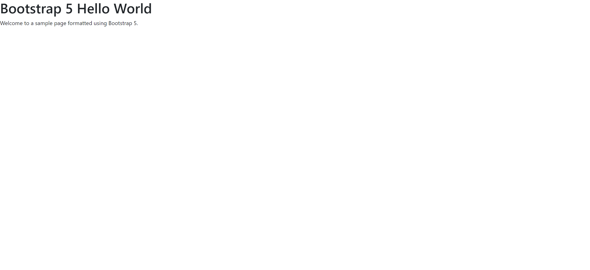
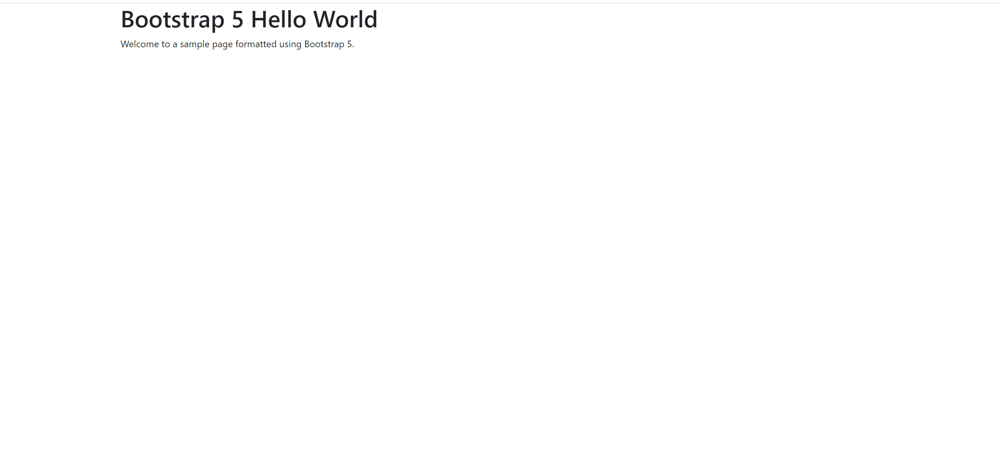
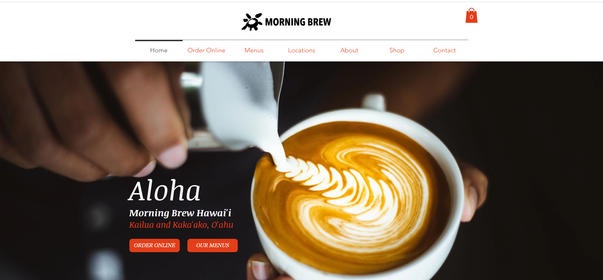
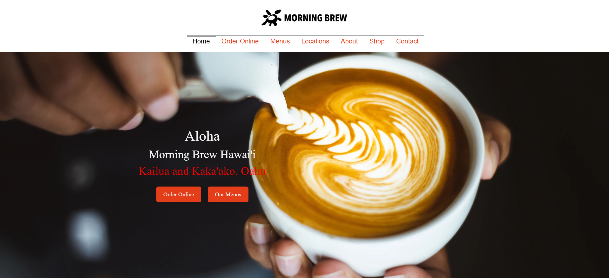

*"Design isn’t just what it looks like and feels like — design is how it works."*– Steve Jobs

In web applications such as HTML, User Interfaces (UI) play an important role in web design. UI consists of many elements such as forms, tables, and navigation bars.  Designing one from scratch using raw HTML and CSS can often pose a challenge due to the need for meticulous design and coding to ensure responsiveness and cross-browser compatibility. 



For example, viewing a webpage from a mobile device on the user-side may look significantly different from how a user views the webpage from a desktop. Additionally, achieving an intuitive and user-friendly layout requires a deep understanding of user behavior and design principles, making the process time-consuming and complex. A developer needs a lot of creativity and knowledge to create UI elements perfectly. Luckily, there is a tool or rather a digital canvas that web developers can utilize to create user interfaces. These are known as UI frameworks,

## The Digital Canvas

A UI framework in web applications is a library of pre-written, standardized code used to build and manage user interfaces efficiently, providing a collection of reusable design elements and components (like buttons, forms, and navigation bars) to ensure consistent and responsive design across different web pages and devices. Developers can leverage these ready-made components to fashion the front end of their web or mobile applications. Essentially, a UI framework encompasses various tools, libraries, and templates designed to expedite the creation of visually appealing, responsive, and user-friendly application interfaces. Let’s talk about how a UI framework, Bootstrap 5, can help expedite web designing.



Here we have two web page images side by side. On the left is a sample text with no margin/padding. On the right is a sample text with Bootstrap 5 margins and padding. Although it may be difficult to notice, designing web pages with the appropriate margins and padding can take excessive amounts of time when there is a lot of content. With UI frameworks such as Bootstrap 5, developers can expedite the time needed for web design. Bootstrap 5's grid system allows developers to easily create complex layouts that adapt to any screen size including mobile views of a webpage. It uses a series of containers, rows, and columns to layout and align content.

Using UI frameworks such as Bootstrap 5 can make web designing more seamless and fluid, but it can also be a challenging tool to utilize. Each framework can be a subset of a programming language in itself. For Bootstrap 5, navigating  utility classes for tasks like text alignment and spacing adjustments can be daunting due to its extensive array of options. The framework's intuitive naming conventions and responsive design principles, involving breakpoints and prefix system (e.g., text-center, mt-3, px-lg-5), require a solid grasp to effectively use. This complexity means that finding the right class for centering text or customizing margins and padding often involves a learning curve, as developers must familiarize themselves with a wide range of classes and understand how they apply across different screen sizes. In my personal experience using Bootstrap 5, I was tasked with recreating a web page identically using this UI framework.

Here is an original vs. recreation of the [Morning Brews Hawaii](https://www.morningbrewhawaii.com/) webpage.


You can see the overlaid text below the navbar on the right image (recreated webpage) is slightly off from the original along with some of the font not matching entirely. It was quite challenging to figure out how to align the text in the center of the webpage.


Below is the html code to design the middle menu of a webpage using Bootstrap 5.
```html
<!-- Overlay Text on Image -->
<div class="image-overlay">
  <div class="row d-flex align-items-center" id="centerText">
    <div class="col-8 text-center">
      <h1>Aloha</h1>
      <h2>Morning Brew Hawai'i</h2>
      <h2 style="color: red;">Kailua and Kaka'ako, Oahu</h2>
      <!-- Buttons -->
      <div class="button-container my-4">
        <a href="#" class="btn btn-primary me-2">Order Online</a>
        <a href="#" class="btn btn-primary">Our Menus</a>
    </div>
  </div>
</div>
``` 

## Limitless Canvas’

Bootstrap 5 isn’t the only UI framework that can streamline web design. Semantic UI is another UI framework that offers pre-built components and utility classes. One key difference between the two frameworks is that semantic UI has a steeper learning curve due to its emphasis on semantic class names and a more extensive set of concepts.

Bootstrap 5 code block:
```html
<div class="container">
  <nav class="navbar navbar-light bg-light">
    <a class="navbar-brand" href="#">MySite</a>
  </nav>

  <h1>Welcome to MySite</h1>
  <p>This is a Bootstrap 5 webpage.</p>

  <footer class="footer mt-auto py-3 bg-light">
    <div class="container">
      © 2024 MySite
    </div>
  </footer>
</div>
```
The Bootstrap 5 version utilizes the framework's built-in classes for styling and responsiveness, such as navbar for the navigation bar and container for centering and padding the main content.

```html
<style>
  body { font-family: Arial, sans-serif; }
  nav, footer { background-color: #f8f9fa; padding: 20px; text-align: center; }
  main { padding: 20px; }
</style>

<nav>
  <a href="#">MySite</a>
</nav>

<main>
  <h1>Welcome to MySite</h1>
  <p>This is a semantic HTML5 webpage.</p>
</main>

<footer>
  © 2024 MySite
</footer>
```
Meanwhile, semantic UI uses elements like ```<header>```, ```<nav>```, ```<main>```, and ```<footer>``` for structural purposes, with custom CSS added for basic styling.

Between the two code blocks, Bootstrap 5 is quick and more user-friendly to understand, but for semantic UI, for structural clarity of the UI, it requires additional CSS for full customization.

## To each their own

UI frameworks like both Bootstrap 5 and semantic UI revolutionize web design by offering pre-built components and responsive design tools, allowing the creation of web pages across different devices. However, mastering these frameworks, with their extensive libraries of classes can present a learning curve for web developers. Despite the initial challenge, the effort is worthwhile for me as a beginner web developer, as it has significantly enhanced my design efficiency. My experience with recreating a web page using Bootstrap 5 underscored the challenges of aligning elements and matching styles precisely, yet it also highlighted the framework's effectiveness in speeding up the web design process and improving responsiveness. For those looking to find the best UI framework for web applications, I would say go with one that you’re most comfortable with and build from there.
