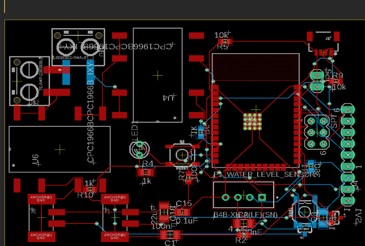

## About

For an Electrical Engineering course, my team built an aquaponics system — a closed-loop setup that pairs aquaculture (raising fish) with hydroponics (growing plants in water), where the fish waste feeds the plants and the plants clean the water. We added sensor peripherals to monitor the health of the pond — water level, temperature, and pH — readable remotely over Wi-Fi.

## My role

I worked the embedded/programming side. I configured the sensor libraries for temperature and water-level readings on an **ESP32-S3** microcontroller using the Arduino IDE, helped assemble the device onto the circuit board, and exposed the readings over a small Wi-Fi web server.

## Learning outcome

Meeting weekly with progress reports gave me a first real taste of how an engineering project runs in practice — scoping the work, splitting it up, negotiating trade-offs when timelines slipped, and presenting the finished system at the end of the semester.
