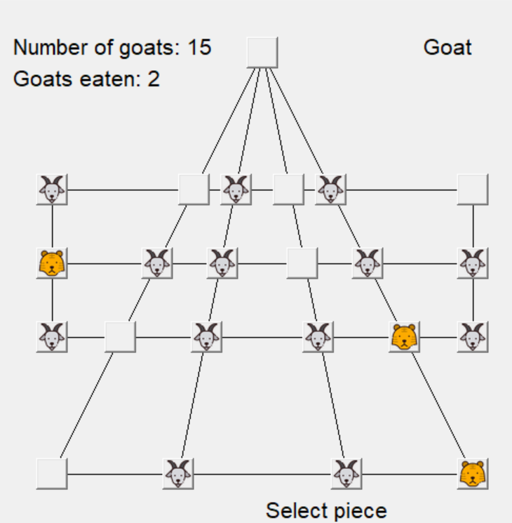

## Overview

In the RL for Inferring Strategies project, the objective is to develop a reinforcement learning technique that trains a machine to play the game, Huligutta (Goats & Tigers), like a human. The focus is on developing a technique that uses strategic positional play to win the game. Huligutta, is a two-player asymmetric board game and is played on a board with 23 positions arranged in a square pattern, popular all over in South Asia (Agarwal, 2018). The objective is to develop a reinforcement learning paradigm to train a neural network to play this strategy game Goats & Tigers. In the game, we want to teach the Goats to play against a Greedy Tiger strategy. To do this a value heuristic is used in the reinforcement learning framework. 
The game has two different types of pieces: Tigers and Goats, they play alternately. Valid moves for both include moving to an adjacent position. At the first phase of the game, 3 Tigers are placed in the upper positions of the board, while a total of 15 Goats may be placed on the remaining 20 of the 23 board positions. At the start of the game, Goats move first. During the first phase, the Tigers may make one valid move or capture (eat) a Goat to reach an empty position on the board, similarly to Checkers. The second phase begins after all Goats are placed, then the Goat-player may make one valid move on their turn. The win condition for Tigers is capturing 5 of the Goats, while for the Goats by obstructing the Tigers' movements such that they reach a stalemate. In the project, because it is known to be more difficult to play as the Goat versus a Greedy Tiger strategy, development for autonomous play for the Goats was best suited for implementing the neural network. The Tigers are programmed with a Greedy strategy such that each move the Tigers make is random but if a Goat is nearby, they will eat the piece at any given opportunity.
There are four reinforcement learning paradigms. The first is the States of the Game, which is the positions of all pieces after a move is made. The second is the Reward, which is the win or loss after a game. Due to the reward not being able to be observed after a move is made, a variant of reinforcement learning was needed with delayed rewards. The third is the Value of the State, and it is the expected reward from that state (The position of all pieces). It is also difficult to calculate the win probability from each state, but this will be explained later. Finally, there’s the Policy, which is determined by values used to play the game or the strategy. These four paradigms will be used to aid in training the neural network. The neural network was developed using TensorFlow, which is an open-source software library for machine learning and artificial intelligence. As of now, the value function has been implemented and overparameterized such that the neural network can be trained using the value function as a target data.

## Interim

In the figure above, this is a winning state when the heuristic successfully stalemates all tigers. As part of this learning process, I have implemented several classes in the game code, such as mapping the board into a matrix in the game class which helps the heuristic analyze the states of the board. Part of the neural network was written for implementing Keras which helped streamline training and develop the corresponding policy from the neuralGoat class. In future work, improvements to training data such as human input. allowing Goats to think 3 steps ahead and more are planned.

## Conclusion

In summary, the project focuses on teaching the Goats to play against a Greedy Tiger strategy using the value heuristic in a reinforcement learning framework then implementing a neural network to mimic the heuristic. The game is characterized by its challenging view in machine learning to develop strategic play. The project utilizes reinforcement learning paradigms such as states of the game, rewards, value of the state, and a policy to aid in training a neural network. Future work will include improvements to training data primarily pausing the training process for human input and using previous training sessions to update state, value pairs for the neural network for an optimized policy. Next semester, students in the project will continue training the neural network using the high-performance cluster (HPC) computers. HPC is a collection of many computers called nodes connected with a network – that solves computational problems which are too large for standard computers. These computers will help further streamline large datasets of training data.
Because the project primarily focuses on the technical aspects of developing the reinforcement learning technique, it does not explicitly consider economic, environmental, sustainability, manufacturability, ethical, health and safety, social, or political factors. However, it is important to consider the ramifications of developed neural networks.  One article relevant to the ethical issues of artificial intelligence comes from Geoffrey Hinton, computer scientist and cognitive psychologist and responsible for various machine learning algorithms, warns that AI can cause dangerous misinformation. Some questions that came up when presenting the project included how the neural network would translate into other applications such as ChatGPT or image processing. If the neural network isn’t trained properly, it would surely cause misinformation and be prone to hallucination as well. Though the project emphasizes the exploration of reinforcement learning paradigms, additional attention to broader considerations such as ethics, social impacts, and sustainability may be warranted for future work. Overall, the RL for inferring strategies project demonstrates progress in studying neural networks and reinforcement learning.

If interested in the project, below is the source code:
https://github.com/roycenainoa/tigersandgoats
