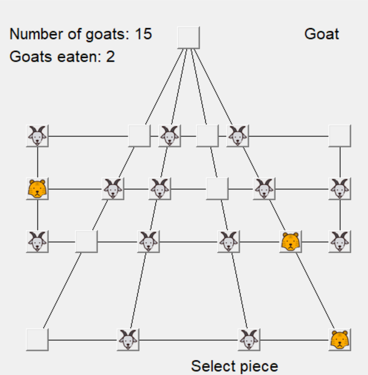

**Source:** [GitHub](https://github.com/roycenainoa/tigersandgoats) &nbsp;·&nbsp; Python · TensorFlow / Keras

<em>A winning state — the heuristic has stalemated all three tigers.</em>

## About

Huligutta (Goats & Tigers) is a two-player asymmetric board game played across 23 positions: three Tigers try to capture five Goats, while fifteen Goats try to trap the Tigers into a stalemate. The Goat side is the harder one to play well, so the project's goal was to train a neural network to play the Goats against a greedy Tiger strategy using reinforcement learning.

## Approach

The RL formulation uses four ingredients: the **state** (all piece positions after a move), a delayed **reward** (win/loss, only known at game end), a **value** function (the expected reward from a state), and a **policy** (how to act). Because the reward is delayed, I used a value heuristic as the training target. I implemented the game model — mapping the board to a matrix so the heuristic can read the state — and built the neural network in TensorFlow / Keras to approximate the value function and derive the Goats' policy.

## Outcome and next steps

The value function was implemented and used to train the network toward strategic, stalemate-seeking play. Future work — continued on the university's high-performance computing (HPC) cluster — includes richer training data, letting the Goats look several moves ahead, and reusing prior training runs to refine the policy.
