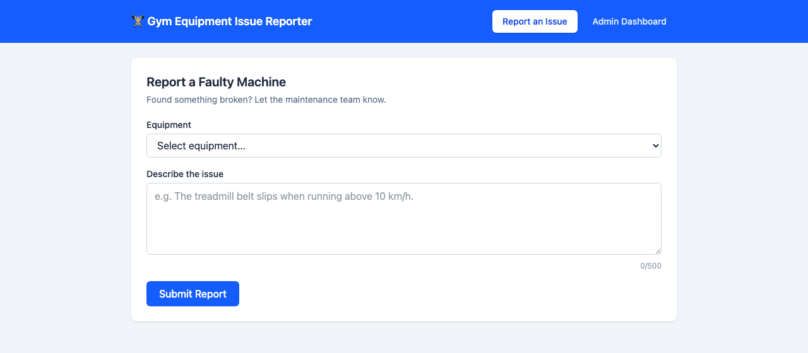
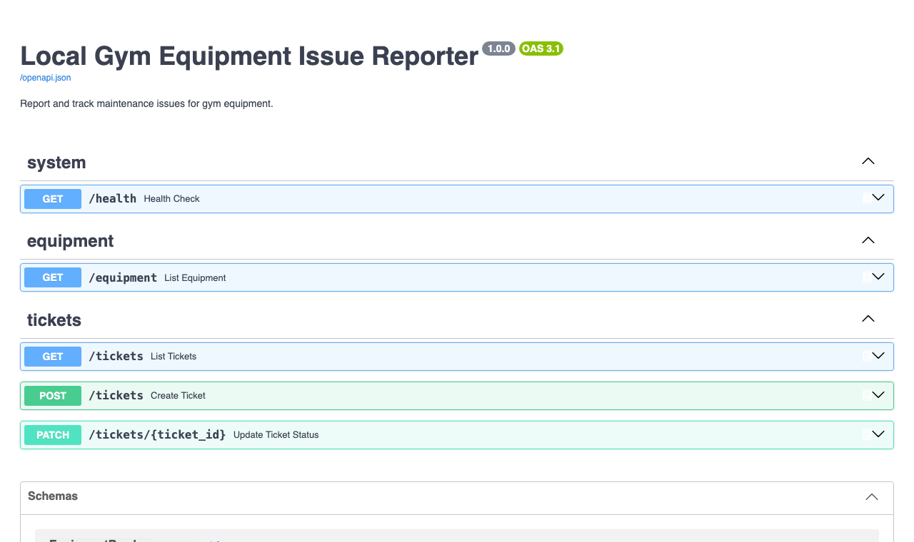

**🔗 Live demo:** [gym-reporter-api.onrender.com](https://gym-reporter-api.onrender.com) &nbsp;·&nbsp; **API docs (Swagger):** [/docs](https://gym-reporter-api.onrender.com/docs) &nbsp;·&nbsp; **Source:** [GitHub](https://github.com/roycenainoa/gym-equipment-issue-reporter)

*The demo runs on a free tier — the first request after idle can take ~50 seconds to wake the server.*

## About

The Gym Equipment Issue Reporter is a full-stack web application that lets gym members report broken or faulty equipment and lets facility managers track and resolve those reports. A member submits a ticket describing the issue; a manager sees the queue on an admin dashboard, updates its status, and closes it out. Built for the DLMCSPSE01 portfolio.

**Member view — report an issue:**

**Backend — auto-generated FastAPI / OpenAPI (Swagger) docs:**

## Stack and design

- **Frontend:** React + Tailwind CSS (Vite)
- **Backend:** Python + FastAPI, with an auto-generated OpenAPI / Swagger UI (the **/docs** link above)
- **Database:** SQLite via the SQLAlchemy ORM, seeded with realistic equipment and sample tickets on first start
- **Containerization:** Docker + docker-compose, deployed to Render as a single service

## Learning outcome

Building this end to end reinforced how the pieces of a full-stack app fit together — designing a REST API, modeling the data, wiring a typed frontend to it, and packaging the whole thing in Docker so it runs the same anywhere.
