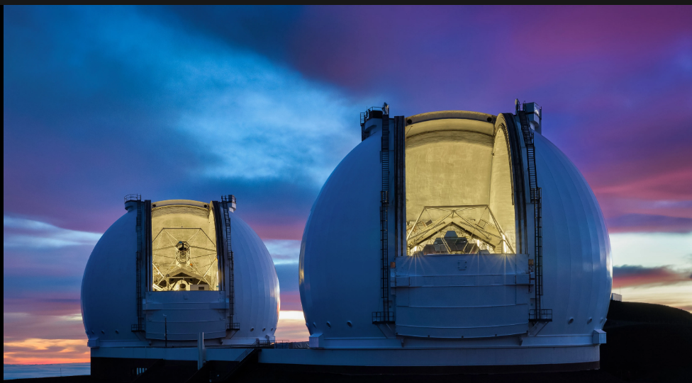

## About

Through the **Akamai Workforce Initiative** — a program that broadens participation in Hawaiʻi's STEM workforce — I interned at the **W. M. Keck Observatory** on Mauna Kea. My project was to modernize the safety-control system for a high-powered laser so it met the observatory's safety standards, and I presented the results at the program's closing symposium.

## What I did

- Updated the **PLC ladder-logic** (RSLogix500) so the laser's controls met safety standards — the core of the work.
- Reviewed the existing designs and planned the hardware integration.
- Designed wire layouts and built the wiring and cables for the **Lock-Out-Tag-Out (LOTO)** switches.
- Tested and verified the PLC functionality.
- Prepared and delivered a technical STEM presentation.

## Learning outcome

This was my first real engineering project, so I leaned heavily on my mentor — asking a lot of questions and taking careful notes to meet the design specs. Working under safety constraints taught me how engineers reason about *what* to implement and *why*.

*The PLC source code isn't shared — it's sensitive to the organization.*
