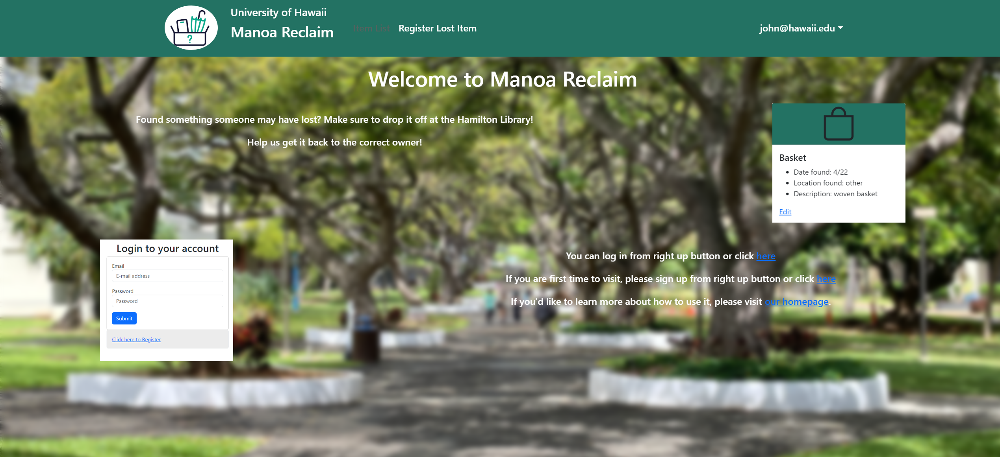
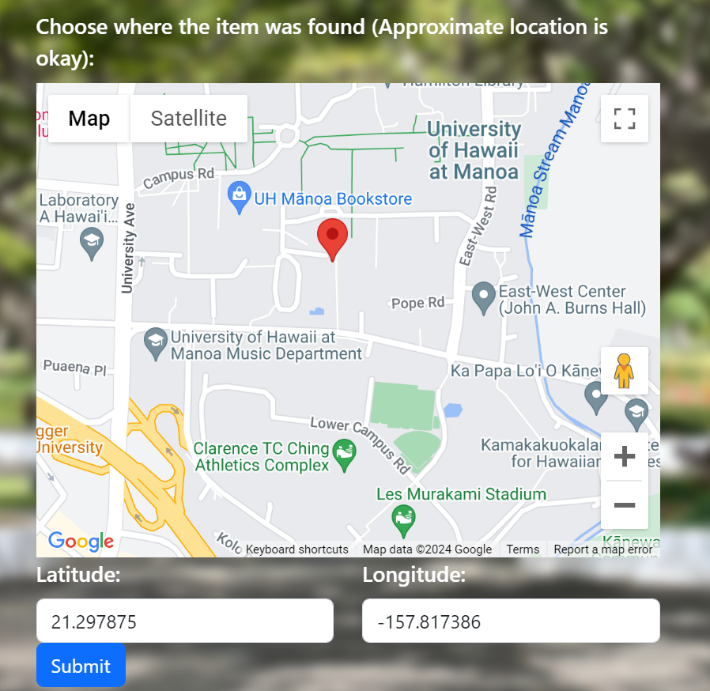
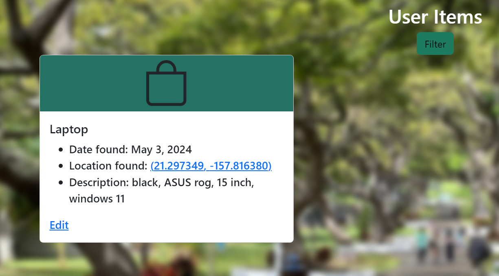

Manoa Reclaim Homepage (site is no longer available for view)

## Overview

In the ICS 314 software engineering project, me and my class were tasks with creating a web application of our choosing. I used JavaScript using IntelliJ IDEA and managed our code with Git and GitHub. The project involved building web applications using the Meteor framework, integrating Bootstrap for design and React Router for navigation. The project I chose to create a web application for was Manoa Reclaim, a lost and found web app.

The Manoa Reclaim web app designed for University of Hawaii (UH) Students simplifies returning lost items such as wallets and phones for owners. It features lists of lost and found items, including their locations. Users can post lost items and browse these lists. Found items placed in specific areas, such as the Campus Center and ID Office, can have messaging disabled to streamline the recovery process. Manoa Reclaim allows students to quickly find items lost on campus and allows people to easily turn in items they find.

## Interim

In the image above, you can see the landing page of the Manoa Reclaim website. When a student registers with their UH email, they can register a lost item they found or list items that have been reported lost in the database. I was responsible for testing the page and creating mockups for several web pages, but one key feature I wanted to implement in the project is a Google Maps API for users to mark the location the item was found.

Here you can see the Register Lost Item page

And here in the form, you can mark the location of the item where it was recovered using Google Maps. The location is then tracked using latitude and longitude coordinates where other users, including the admins in charge of overseeing the items can view the lost item and open the links to the coordinates the item was retrieved.

## Conclusion

Although Manoa Reclaim has much fine tuning such as adding images to view the item, contact information and more. This project, Manoa Reclaim, offered valuable experience as a software engineer when getting a project off the ground. One valuable tool my team mates and I have utilized is the Issue Driven Project Management (IDPM) to help manage the workflow of the project. Logging hours worked on a task, splitting one task into subtasks and managing time helped streamline development of Manoa Reclaim. At this time, I hope to improve Manoa Reclaim so that UH students can find this web application useful.

If interested in the project, here is the projects documentation and source code:
- [Homepage](https://manoa-reclaim.github.io/)
- [Source Code (GitHub)](https://github.com/manoa-reclaim/Manoa-reclaim-app)
