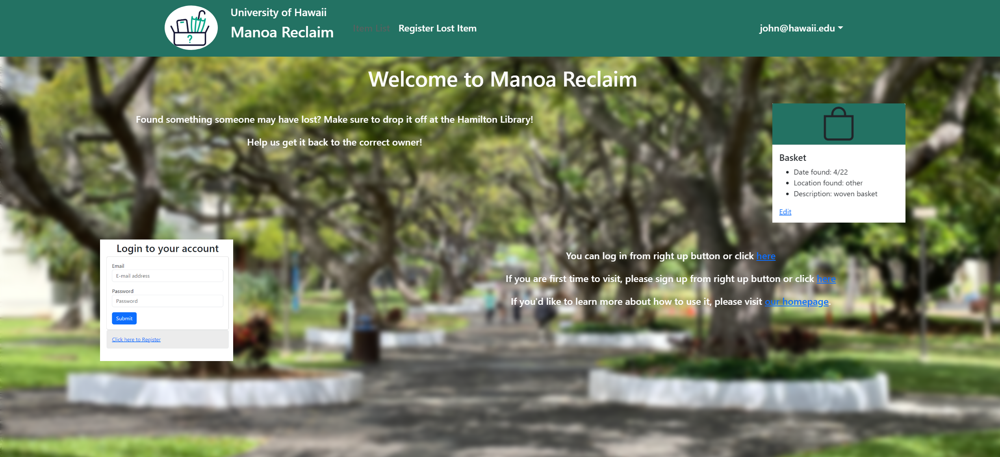
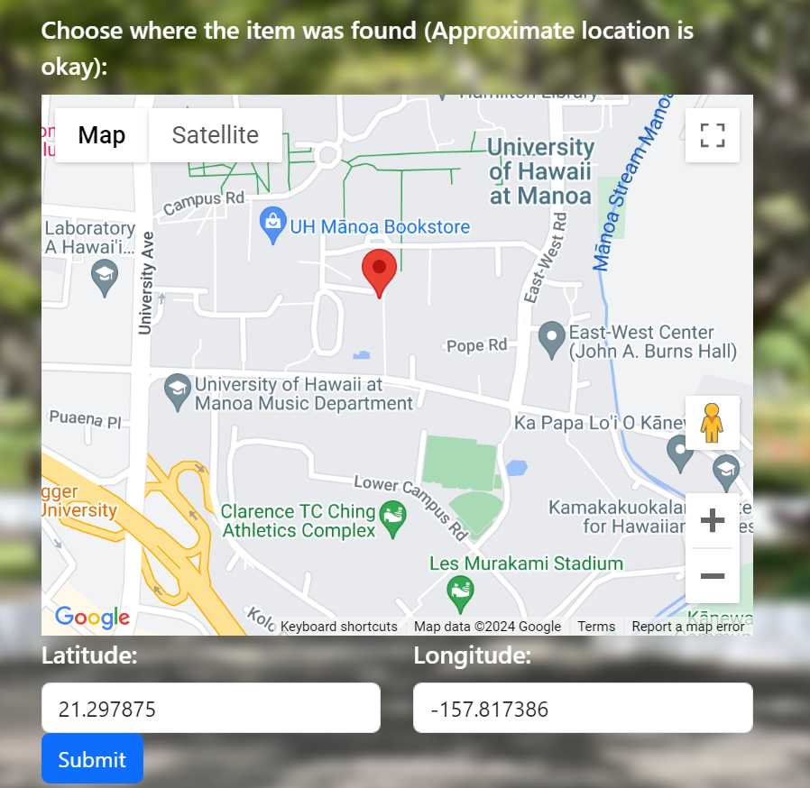
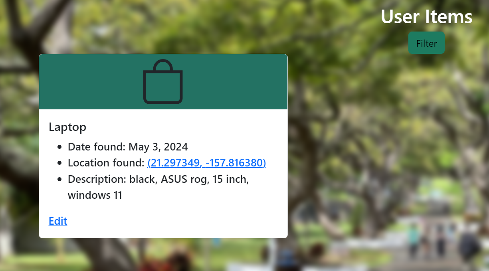

**Source:** [GitHub](https://github.com/manoa-reclaim/Manoa-reclaim-app) &nbsp;·&nbsp; [Project homepage](https://manoa-reclaim.github.io/) &nbsp;·&nbsp; Meteor · React · MongoDB

## About

In the ICS 314 software-engineering course, my team built a web application of our choice; I chose **Manoa Reclaim**, a lost-and-found app for UH students. It lets students post lost items and browse lists of lost and found items along with their locations — so someone who finds an item can quickly get it back to the owner. It's built on the **Meteor** framework with **React Router** for navigation and **Bootstrap** for the UI, managed with Git and GitHub.

## What I built

I was responsible for testing pages and building mockups, and I implemented a **Google Maps** feature so a user can mark exactly where an item was found — stored as latitude/longitude and viewable by other students and by the admins overseeing the items.

**Register a found item:**

**Mark the location on a map:**

**Browse the item list:**

## Learning outcome

This was valuable experience getting a real software project off the ground. My team used **Issue-Driven Project Management (IDPM)** — logging hours per task, splitting tasks into subtasks, and managing time — which kept the workflow organized from start to finish.
